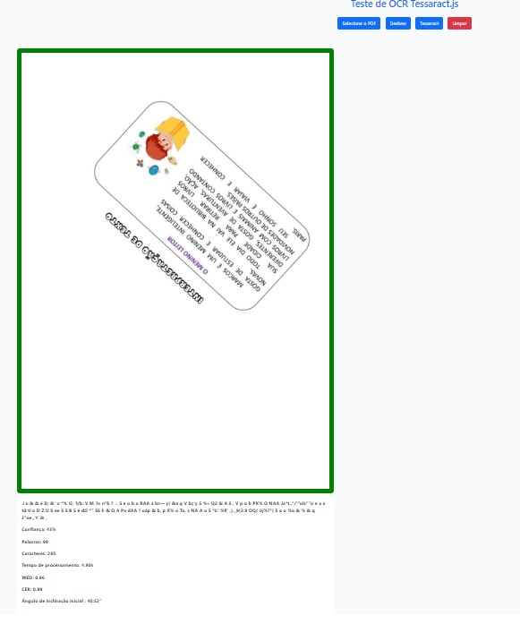
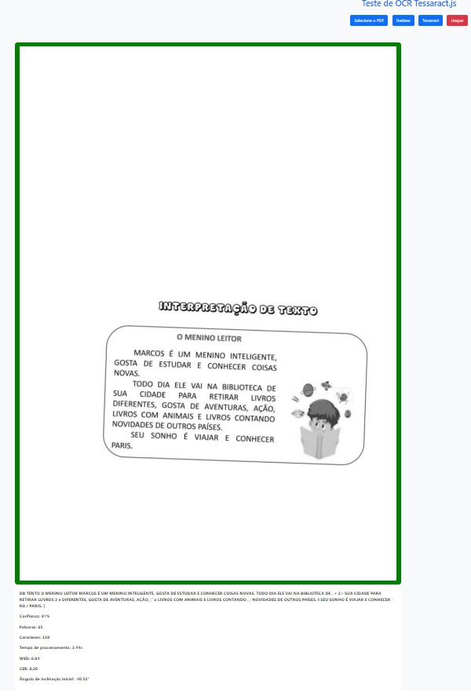

# Deskew OCR Optimizer

Este projeto é uma aplicação React que utiliza OCR (Reconhecimento Óptico de Caracteres) para extrair texto de imagens e PDFs. Ele faz uso das bibliotecas `tesseract.js` e `opencv-js` para realizar o OCR e otimizar as imagens.

## Funcionalidades

- Carregar imagens e PDFs.
- Extrair texto de imagens usando OCR.
- Exibir o texto extraído e métricas de desempenho.
- Otimizar imagens para melhorar a precisão do OCR.

## Tecnologias Utilizadas

- React
- Tesseract.js
- OpenCV.js
- React Router

## Instalação

1. Clone o repositório:
   ```bash
   git clone https://github.com/brunokobi/deskew-ocr-optimizer.git
   ```
2. Navegue até o diretório do projeto:
   ```bash
   cd deskew
3. Instale as dependências:
   ```bash
   npm install
   ```

## Uso

1. Inicie a aplicação:
   ```bash
   npm start
   ```
2. Acesse a aplicação em seu navegador:
   ```
   http://localhost:3000
   ```

## Estrutura do Código

- `App.js`: Componente principal da aplicação.
- `Deskew.js`: Componente que contém a lógica de OCR e manipulação de imagens.
- `App.css`: Estilos da aplicação.
- `loading.js`: Componente de carregamento.

## Exemplo de Código

```javascript

  const handleDeskewOCROptimize = async () => {
    if (images) {
        const imageElement = document.createElement('img');
        imageElement.src = images;
        
        imageElement.onload = async () => {
            // Carregar a imagem com OpenCV.js
            const src = cv.imread(imageElement);
            
            // Converter para escala de cinza
            const gray = new cv.Mat();
            cv.cvtColor(src, gray, cv.COLOR_RGBA2GRAY, 0);            
            
            // Binarização da imagem para encontrar contornos
            const binary = new cv.Mat();
            cv.threshold(gray, binary, 0, 255, cv.THRESH_BINARY_INV + cv.THRESH_OTSU);
            
            // Encontrar contornos
            const contours = new cv.MatVector();
            const hierarchy = new cv.Mat();
            cv.findContours(binary, contours, hierarchy, cv.RETR_EXTERNAL, cv.CHAIN_APPROX_SIMPLE);
            
            if (contours.size() > 0) {
                const contour = contours.get(0);
                const rotatedRect = cv.minAreaRect(contour);
                let angle = rotatedRect.angle;
                setAngleStart(angle);
                
                // Ajustar o ângulo conforme necessário
                if (rotatedRect.size.width < rotatedRect.size.height) {
                    angle += 90;
                }
                
                // Se a inclinação inicial for maior para a direita, rotaciona no sentido anti-horário
                if (angle > 0) {
                    angle = angle - 180;
                }
                // Se a inclinação inicial for maior para a esquerda, rotaciona no sentido horário
                else if (angle < 0) {
                    angle = angle + 180;
                }

                // Verificar se o ângulo está próximo de 0 ou 180 (imagem já está corretamente alinhada)
                if (Math.abs(angle - 180) < 1 || Math.abs(angle) < 1) { // Tolerância de 1 grau
                    // Manter a imagem original
                    setSelectedImage(images);
                } else {
                    // Corrigir a inclinação da imagem
                    const center = new cv.Point(src.cols / 2, src.rows / 2);
                    const M = cv.getRotationMatrix2D(center, angle, 1);
                    const dst = new cv.Mat();
                    cv.warpAffine(src, dst, M, new cv.Size(src.cols, src.rows), cv.INTER_LINEAR, cv.BORDER_REPLICATE, new cv.Scalar());
                    
                    // Exibir a imagem corrigida
                    const deskewedCanvas = document.createElement('canvas');
                    cv.cvtColor(dst, dst, cv.COLOR_RGBA2GRAY); // Convert to grayscale
                    cv.imshow(deskewedCanvas, dst);
                    setSelectedImage(deskewedCanvas.toDataURL());

                    // Limpar a memória
                    dst.delete();
                    M.delete();
                }
                
                // Limpar a memória
                contour.delete();
            } else {
                console.error('Nenhum contorno encontrado na imagem.');
            }
            
            // Limpar a memória
            src.delete();
            gray.delete();
            binary.delete();
            contours.delete();
            hierarchy.delete();
        };
        
        imageElement.onerror = (e) => {
            console.error('Erro ao carregar a imagem:', e);
        };
    } else {
        setSelectedImage(null);
        setTextResult("");
    }
};

```
## Telas da Aplicação
<p align="center">Documento 1</p>
<p align="center">


</p>
<p align="center">Documento 2</p>
<p align="center"> 


</p>

## Contribuição

Sinta-se à vontade para contribuir com este projeto. Para isso, siga os passos abaixo:

1. Faça um fork do projeto.
2. Crie uma nova branch:
   ```bash
   git checkout -b minha-nova-funcionalidade
   ```
3. Faça suas alterações e commit:
   ```bash
   git commit -m 'Adiciona nova funcionalidade'
   ```
4. Envie para o repositório remoto:
   ```bash
   git push origin minha-nova-funcionalidade
   ```
5. Abra um Pull Request.

## Licença

Este projeto está licenciado sob a licença MIT. Veja o arquivo [LICENSE](LICENSE) para mais detalhes.

